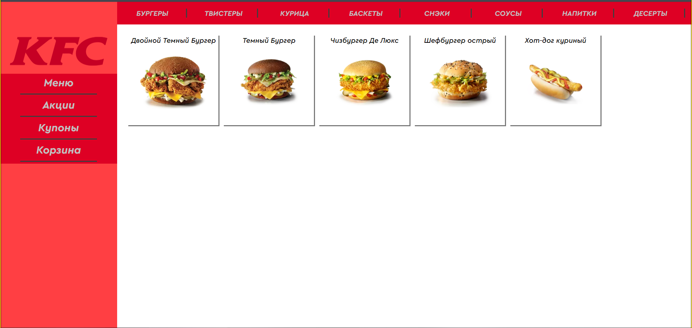
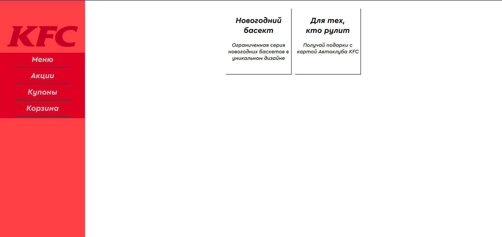
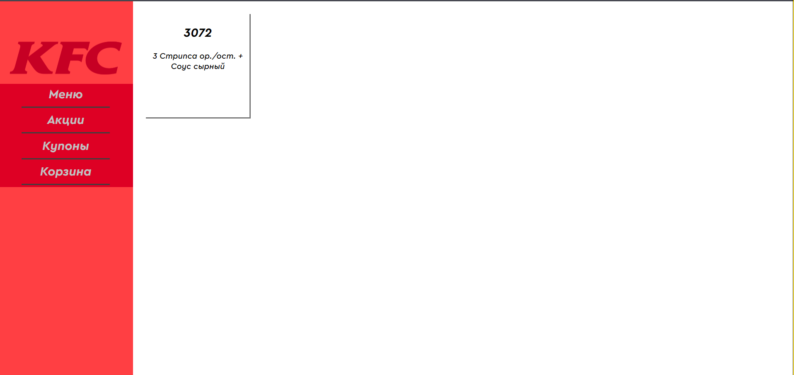
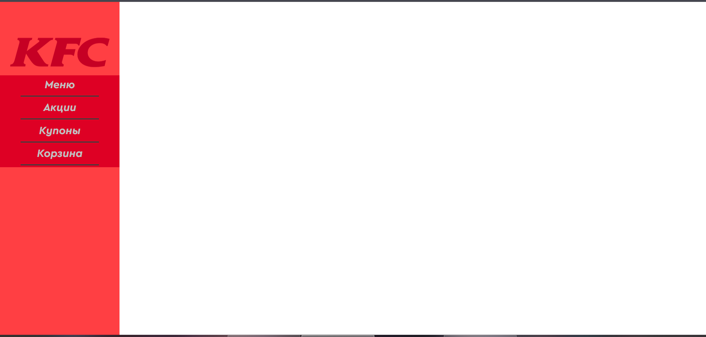
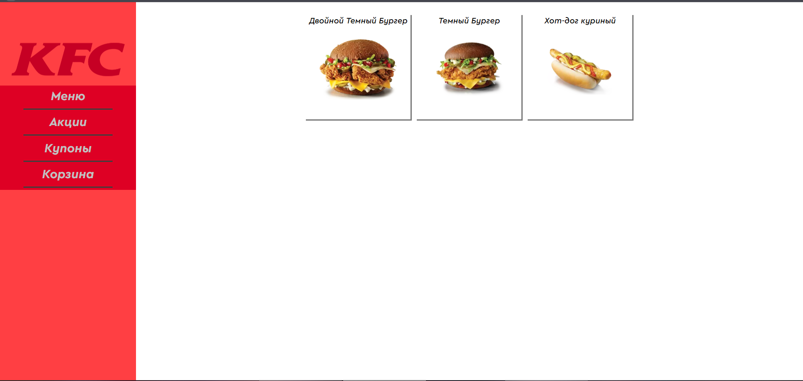
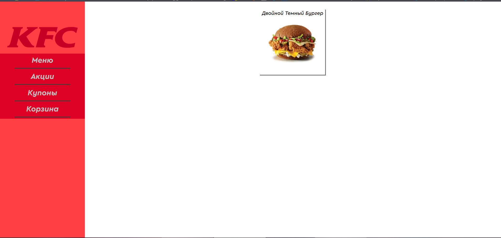

# KotlinJS Course
-----------------------------------

### 1. Страница "Меню"

### 2. Страница "Акции"

### 3. Страница "Купоны"

### 4. Страница "Корзина"

### 5. Страница "Добавление в корзину при нажатии на блюдо из меню"

### 6. Страница "Удаление блюда при нажатии на него из корзины"

