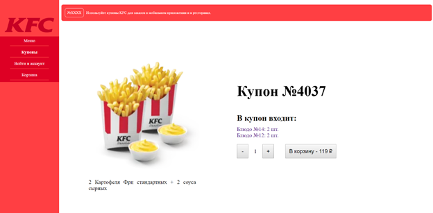
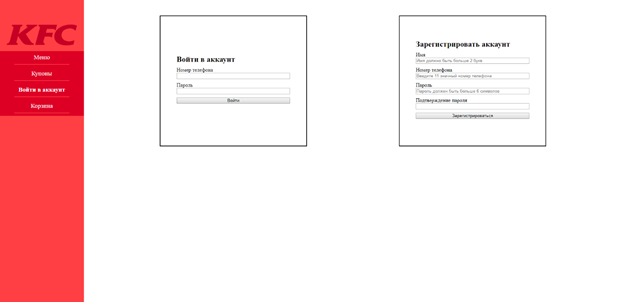

# KotlinJS Course
-----------------------------------

При выборе пункта «Меню» в навигационном блоке появляется список блюд в зависимости от выбранной категории.
### 1. Страница "Меню"

Если нажать на понравившееся блюдо, то мы попадем на страничку с описанием блюда. При желании можно добавить данную позицию в корзину, указав количество.
### 2. Страница "Блюдо"

При выборе пункта «Купоны» отображается список всех купонов с кратким описанием.
### 3. Страница "Купоны"

При выборе понравившегося купона можно перейти на страницу с полным описанием. У пользователя есть возможность посмотреть, что входит в купон, и при желании перейти на страницу с блюдом или добавить купон в корзину.
### 4. Страница "Купон"

Если пользователь еще не авторизовался, то он может это сделать, нажав на пункт «Войти в аккаунт».
### 5. Страница "Войти в аккаунт"

После успешной авторизации пользователь оказывается в своем профиле, где может посмотреть список предыдущих заказов и информацию о себе.
### 6. Страница "Аккаунт"

При выборе пункта «Корзина» отображается список позиций в корзине и итоговую сумму заказа. Пользователь имеет возможность оформить заказ, если он авторизовался, и корзина не является пустой, или отчистить корзину.
### 7. Страница "Корзина"

Если пользователь является администратором, то он может попасть на страницу с добавлением нового блюда или купона.
### 8. Страница "Добавление нового блюда"

### 9. Страница "Добавление нового купона"
